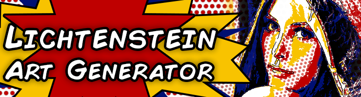

# Lichtenstein Generator



Lichtenstien Generator is as it says: a generator of Roy Lictenstein style art from pre-existing image. It does this by:

  - You supplying an image and loading it into the program
  - Adjusting the options in the interface to your desired requirements
  - Generating the new image and saving the output
  
### Version
1.0.0

### Tech

Tested on Python 2.7.9, haven't seen how backwards compatible it is with older versions of 2.7.

FBAlbumDownloader uses a few additional module to work properly:

* **[Pillow2.5+]**  - Used to read, write and edit the images. ([Link](https://github.com/python-pillow/Pillow))
* **[Tkinter]**     - This is the GUI used for the program. Usually this is already included in Python installations by default.
  * **[ImageTk]**     - Used to view the original and resultant images in the GUI. If you’re using a prebuilt version of PIL, you might need to install additional packages to be able to use the ImageTk module. For example, on Ubuntu, you need both python-imaging and python-imaging-tk.

### Installation
To install the program, all you need is Python 2.7.9 installed and Pillow correctly installed on your system. Then, all you need to do is run ```LichtensteinGenerator.py``` found in the root of the Git directory.

### How to Use
To use the program, simply open an image as requested on start-up. This will load the image into the program. You can then proceed to press the Generate button in the bottom right to create the output. Depending on the size of the image this may take a while. Once the generation is complete you are able to save the output by pressing Save in the bottom right. You can also cycle between the original and the generated result using the tabs in the top left.

For more detailed instructions, see https://github.com/JFDesigner/LichtensteinGenerator/blob/master/docs/UserManual.pdf

### To-Do

I most likely won't make any changes to the program from now as it's an  old assignment I completed for my course (Computer Visualisation & Animation) at the NCCA. The final version was published on 06/06/2015.

Also, it has not been optimised at all so it will be slow with large images. Bare that in mind when using the program, if it takes forever it may have either crashed from a memory shortage or is still taking its time to complete the process.

## Contact

If you have problems or questions then please contact me by emailing me at jonflynn@jfdesigner.co.uk.

## Website

Visit my portfolio to see more of my work and interesting programs at http://jfdesigner.co.uk/

License
----

GPL V2

